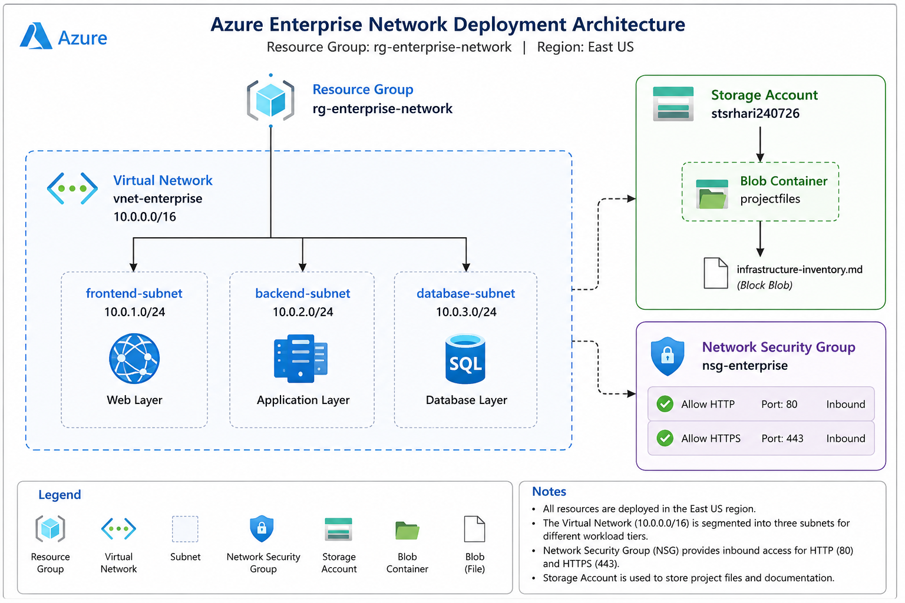

# Azure Enterprise Network Deployment

Deploying a secure Azure enterprise network using Azure CLI with Virtual Network, subnets, Network Security Groups, Azure Storage, and Blob Storage. This project demonstrates core Azure infrastructure deployment and management skills.

---

# Architecture

> **Note:** Upload your architecture diagram to the `architecture/` folder and update the image path below.

```text
architecture/
└── architecture-diagram.png
```

```markdown

```

---

# Project Overview

This project demonstrates the deployment of a secure enterprise-style network in Microsoft Azure using Azure CLI.

The environment includes:

- Resource Group
- Virtual Network
- Three Subnets
- Network Security Group (NSG)
- Storage Account
- Blob Storage Container
- Infrastructure Documentation

---

# Azure Services Used

| Service | Purpose |
|---------|---------|
| Azure Resource Group | Logical container for resources |
| Azure Virtual Network | Network isolation |
| Azure Subnets | Separate application tiers |
| Network Security Group | Traffic filtering |
| Azure Storage Account | Object storage |
| Azure Blob Storage | Store project documentation |
| Azure CLI | Infrastructure deployment |

---

# Architecture Components

## Resource Group

| Name |
|------|
| rg-enterprise-network |

---

## Virtual Network

| Name | Address Space |
|------|---------------|
| vnet-enterprise | 10.0.0.0/16 |

---

## Subnets

| Subnet | Address Prefix |
|---------|----------------|
| frontend-subnet | 10.0.1.0/24 |
| backend-subnet | 10.0.2.0/24 |
| database-subnet | 10.0.3.0/24 |

---

## Network Security Group

**Name**

```
nsg-enterprise
```

### Security Rules

| Rule | Port | Protocol |
|------|------|----------|
| Allow HTTP | 80 | TCP |
| Allow HTTPS | 443 | TCP |

---

## Storage

| Resource | Name |
|----------|------|
| Storage Account | stsrhari240726 |
| Blob Container | projectfiles |
| Blob | infrastructure-inventory.md |

---

# Deployment Workflow

1. Create Resource Group
2. Create Virtual Network
3. Create Subnets
4. Create Network Security Group
5. Configure NSG Rules
6. Associate NSG with Frontend Subnet
7. Create Storage Account
8. Create Blob Container
9. Upload Infrastructure Inventory
10. Verify Blob Upload

---

# Repository Structure

```text
azure-enterprise-network-deployment/
│
├── README.md
├── architecture/
├── docs/
├── scripts/
└── screenshots/
```

---

# Validation

Blob upload verified successfully using Azure CLI.

Example command:

```bash
az storage blob list \
--account-name stsrhari240726 \
--container-name projectfiles
```

---

# Skills Demonstrated

- Azure Networking
- Azure Storage
- Azure CLI
- Network Security
- Infrastructure Deployment
- Blob Storage Management
- Technical Documentation

---

# Future Improvements

- Azure Bastion
- Virtual Machines
- Azure Key Vault
- Azure Load Balancer
- Azure Application Gateway
- Terraform Automation

---

# Author

**Srihari Shetty**

Cloud Engineer | Azure | DevOps | Infrastructure Automation
